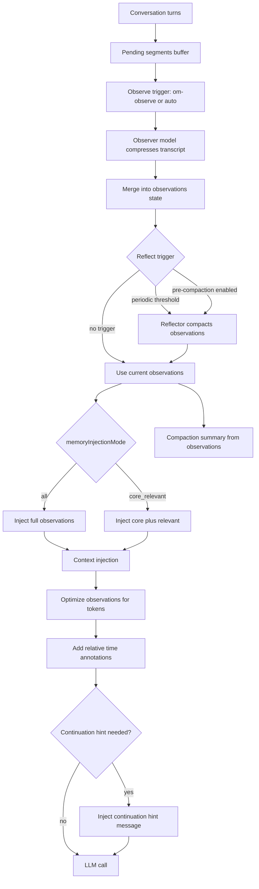
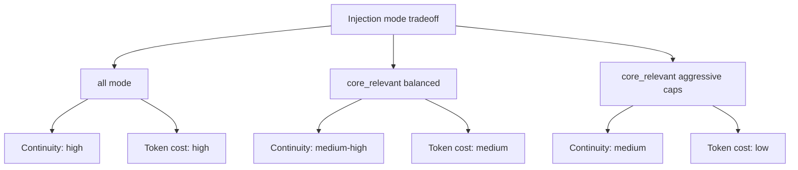

# Observational Memory (Pi extension)

Project-local Pi extension for long-session memory compression and context injection.

Path:
- `.pi/extensions/observational-memory/index.ts`

Config:
- `.pi/extensions/observational-memory/om-config.json`

---

## Inspiration

This extension is inspired by **Mastra** memory patterns and adapts them for Pi extension workflows.

---

## What it does

1. **Compresses chat history into observations**
   - Builds compressed memory (`observations`, `currentTask`, `suggestedResponse`) from pending transcript segments.
   - Uses Gemini CLI first (configurable model), then API fallback.

2. **Injects memory into LLM context**
   - Injects hidden custom memory message (`observational-memory-context`) in `context` event.
   - Prevents duplicate OM injections each turn.

3. **Supports two runtime memory strategies**
   - `memoryInjectionMode: "all"` → inject full observations each LLM call.
   - `memoryInjectionMode: "core_relevant"` → inject:
     - small core memory (token-capped)
     - relevant observation subset for current turn (keyword-based retrieval, item + token capped)

4. **Compaction always includes observations**
   - Before compaction, extension observes compaction candidates.
   - Compaction summary is generated from current OM observations.
   - `/om-observe` can trigger overwrite-style compaction (force mode behavior).

5. **Persistent state**
   - Session custom entries: `observational-memory-state`
   - Optional SQLite persistence by scope.

---

## Mastra-aligned features

### Rich Observer prompt

The observer uses a comprehensive extraction prompt modeled on Mastra's memory system:

- **User assertion vs question distinction**: "I prefer tabs" → assertion (🔴); "Can you refactor?" → question (🟡)
- **State change tracking**: "I switched from REST to GraphQL" → supersedes previous info
- **Temporal anchoring**: Each observation has a creation timestamp + optional referenced date
- **Technical detail preservation**: Exact file paths, line numbers, error messages, commands
- **Tool call sequence grouping**: Related tool calls grouped with indentation
- **Architecture decision capture**: Decision + reasoning preserved together
- **Unusual phrasing preservation**: User's exact words quoted when non-standard

### Priority emoji system (🔴🟡🟢)

Observations are tagged with priority levels:

| Emoji | Priority | Examples |
|-------|----------|----------|
| 🔴 | High | User preferences, goals achieved, critical decisions, blockers |
| 🟡 | Medium | Project details, tool results, file changes, implementation progress |
| 🟢 | Low | Minor details, uncertain observations, exploratory notes |

During context injection, 🟡 and 🟢 emojis are stripped to save tokens (observations still retained, just without emoji prefix). 🔴 items keep their marker.

### Date-grouped output format

Observer output is structured by date with 24-hour timestamps:

```
Date: Feb 12, 2026
* 🔴 (14:30) User stated project uses Next.js 15 with App Router
* 🟡 (14:45) Agent implemented fuzzy matching in src/utils/searchUtils.ts
  * -> added Levenshtein distance calculation
  * -> integrated with existing SearchBar component

Date: Feb 13, 2026
* 🟡 (09:15) Continued search feature - added result highlighting
* 🔴 (09:30) User found bug: search fails on special characters
```

### Relative time annotations

When observations are injected into context, date headers get relative time annotations:

```
Date: Feb 12, 2026 (yesterday)
...
[1 week later]
Date: Feb 19, 2026 (today)
```

Features:
- `formatRelativeTime()` — "2 days ago", "yesterday", "today", "in 3 days"
- `formatGapBetweenDates()` — "[3 days later]", "[2 weeks later]" gap markers between date groups
- `expandInlineEstimatedDates()` — inline references like `(meaning Feb 10)` become `(meaning Feb 10 - 3 days ago)`
- Future intent detection — "User will implement X" + past date → "(likely already happened)"

### Continuation hint

When older conversation turns are dropped and observations bridge the gap, a continuation hint message is injected:

- Tells the model to treat observations as its own memory
- Instructs seamless continuation without "based on our previous conversation" phrasing
- Only activates when the first recent message isn't from the user (indicating context trimming)
- Injected as a separate `observational-memory-continuation` custom message

### Context instructions after observations

Observations are wrapped in structured XML tags with Mastra-aligned instructions:

```xml
<observations>
Date: Feb 13, 2026 (today)
* 🔴 (09:30) User prefers server components for data fetching
...
</observations>

<current-task>
Implementing search autocomplete with debouncing
</current-task>

<suggested-response>
Show the user the SearchBar changes and ask about debounce timing
</suggested-response>
```

Instructions tell the model to:
- Reference specific details from observations (no generic advice)
- Prefer most recent information when conflicts exist
- Treat user assertions as authoritative
- Assume planned actions are complete when their date has passed

### Context injection optimization

Before injection, observations are optimized to save tokens:
- 🟡 and 🟢 emoji prefixes removed (content preserved)
- Semantic tag brackets cleaned
- Multiple whitespace collapsed

---

## Reflection status

Reflection is now wired into runtime behavior:

- Reflection rewrites the **same canonical memory fields** used for injection and compaction:
  - `observations`
  - `currentTask`
  - `suggestedResponse`
- Auto reflection can run after observe based on thresholds.
- Aggressive reflection can run before compaction.
- Manual reflection is available via `/om-reflect`.

### Observer instruction echo (format-aware reflector)

The reflector prompt includes the full observer output format spec (priority emojis, date grouping, 24h timestamps). This ensures:

- Reflections maintain the same structured format as observations
- Old-format observations (plain markdown bullets) are **converted** to the new format during reflection
- Priority emojis are assigned based on content importance during conversion
- Date grouping is applied even if input observations lack dates

---

## High-level flow (graph)



---

## Commands

- `/om-status`
  - Shows OM status (scope, config source, injection mode, token counts, runs).

- `/om-config`
  - Shows active config values.

- `/om-config reload`
  - Reloads config from `om-config.json`.

- `/om-config edit`
  - Opens in-Pi JSON editor and saves config (project-local path).

- `/om-observe`
  - Forces observation now.
  - If `forceObserveAutoCompact=true`, also triggers force compaction flow.

- `/om-observe --no-compact`
  - Force observe without triggering compaction.

- `/om-reflect`
  - Force reflection now using current observations.

- `/om-reflect --aggressive`
  - Force more aggressive reflection compression.

- `/om-observations`
  - Prints current compressed observations + task/next-step fields.

- `/om-clear`
  - Clears OM state.

---

## Config (`om-config.json`)

```json
{
  "recentTurnBudgetTokens": 12000,
  "maxObservationItems": 1200,
  "maxObserverTranscriptChars": 200000,
  "maxReflectorObservationsChars": 240000,
  "geminiCliModel": "gemini-2.5-flash",
  "forceObserveAutoCompact": true,
  "memoryInjectionMode": "all",
  "coreMemoryMaxTokens": 500,
  "relevantObservationMaxItems": 20,
  "relevantObservationMaxTokens": 1400,
  "enableReflection": true,
  "reflectEveryNObservations": 3,
  "reflectWhenObservationTokensOver": 3000,
  "reflectBeforeCompaction": true,
  "autoObservePendingTokenThreshold": 8000
}
```

### Deep config guide

#### 1) Observation input sizing

- `recentTurnBudgetTokens`
  - **What:** max recent non-system conversation budget kept for each call.
  - **Higher:** better continuity, more prompt cost.
  - **Lower:** cheaper prompts, higher risk of missing fresh context.
  - **Typical range:** `6000-20000`.

- `maxObserverTranscriptChars`
  - **What:** hard character cap sent to the observer/compressor.
  - **Higher:** preserves more history during observation runs.
  - **Lower:** faster/cheaper observation, may clip older details.
  - **Typical range:** `100000-300000`.

#### 2) Memory state size

- `maxObservationItems`
  - **What:** max number of merged observation lines retained.
  - **Higher:** richer long-term memory but can grow noisy.
  - **Lower:** cleaner and cheaper, but more aggressive forgetting.
  - **Typical range:** `300-2000`.

- `maxReflectorObservationsChars`
  - **What:** cap for observation text passed to reflector prompts.
  - **Higher:** deeper reflection quality.
  - **Lower:** quicker reflection loops.
  - **Typical range:** `100000-300000`.

#### 3) Model and trigger behavior

- `geminiCliModel`
  - **What:** Gemini CLI model used first for compression.
  - **Tip:** choose faster model for high-frequency observe loops, stronger model for quality-sensitive projects.

- `forceObserveAutoCompact`
  - **What:** if true, `/om-observe` also triggers a force compaction path.
  - **Use true when:** you want observe+compact as one operation.
  - **Use false when:** you want to inspect observations before compaction.

- `enableReflection`
  - **What:** enables reflector stage.
  - **Use true when:** you want periodic consolidation.

- `reflectEveryNObservations`
  - **What:** periodic trigger after this many successful observe runs.
  - **Lower:** more frequent cleanup, higher model usage.
  - **Higher:** less overhead, more raw observation growth.

- `reflectWhenObservationTokensOver`
  - **What:** token-trigger threshold for reflection.
  - **Lower:** reflection runs sooner.
  - **Higher:** reflection waits for larger memory blocks.

- `reflectBeforeCompaction`
  - **What:** runs aggressive reflection before compaction summary generation.
  - **Use true when:** compaction boundaries should snapshot best-possible memory.

- `autoObservePendingTokenThreshold`
  - **What:** auto-observe when pending tokens exceed this threshold. Default `8000`; set `0` to disable.
  - **Why:** prevents deadlock where pending memory grows but compaction never triggers.
  - **Use lower when:** you want observations to stay fresher.
  - **Use higher when:** you want fewer observer calls.

#### 4) Injection strategy

- `memoryInjectionMode`
  - `"all"`:
    - inject all observations each model call.
    - strongest continuity, highest token use.
  - `"core_relevant"`:
    - inject compact core + query-relevant subset.
    - better efficiency, may miss weakly related context.

#### 5) `core_relevant` tuning (used only when mode is `core_relevant`)

- `coreMemoryMaxTokens`
  - **What:** cap for always-included core memory block.
  - **Too low:** important stable facts can drop.
  - **Too high:** token savings shrink.

- `relevantObservationMaxItems`
  - **What:** max retrieved lines for current-turn relevance.
  - **Too low:** brittle retrieval.
  - **Too high:** noisy and expensive.

- `relevantObservationMaxTokens`
  - **What:** token cap for relevant subset.
  - **Acts as final guardrail** when many lines are retrieved.

---

## Config tradeoff graph



---

## Practical presets

### Reliability-first

```json
{
  "memoryInjectionMode": "all",
  "recentTurnBudgetTokens": 16000,
  "maxObservationItems": 1500
}
```

### Balanced

```json
{
  "memoryInjectionMode": "core_relevant",
  "coreMemoryMaxTokens": 700,
  "relevantObservationMaxItems": 24,
  "relevantObservationMaxTokens": 1600
}
```

### Cost-first

```json
{
  "memoryInjectionMode": "core_relevant",
  "recentTurnBudgetTokens": 8000,
  "coreMemoryMaxTokens": 350,
  "relevantObservationMaxItems": 12,
  "relevantObservationMaxTokens": 900
}
```

---

## Storage and env flags

- `PI_OM_SCOPE=thread|resource`
- `PI_OM_SQLITE=1`
- `PI_OM_SQLITE_PATH=/absolute/path/to/om.sqlite`
- `PI_OM_GEMINI_MODEL=gemini-2.5-flash` (override Gemini CLI model)

Notes:
- `resource` scope auto-enables SQLite.
- Config load order:
  1. `.pi/extensions/observational-memory/om-config.json` (project)
  2. `~/.pi/agent/extensions/observational-memory/om-config.json` (global)
  3. defaults in code

---

## Recommended usage

- Keep `memoryInjectionMode="all"` when you want maximum continuity reliability.
- Use `memoryInjectionMode="core_relevant"` to reduce per-call prompt cost.
- Run `/om-observe` before manual `/compact` when you want fresh memory snapshot.
- Use `/om-config edit` for fast tuning in Pi.
- The priority emoji system (🔴🟡🟢) helps the observer distinguish critical user facts from routine progress.
- Relative time annotations help the model reason about temporal context without manual date math.
- The continuation hint ensures seamless conversation flow when older turns are dropped.
