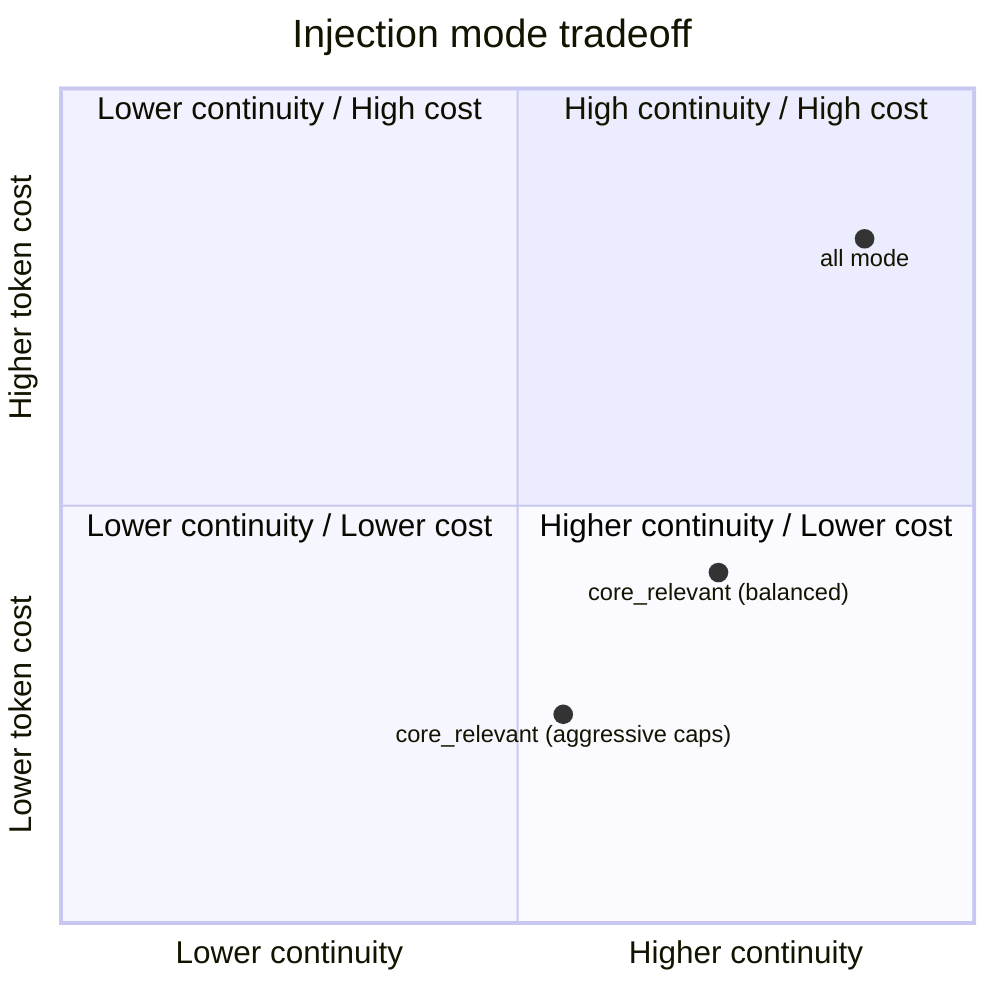

# Observational Memory (Pi extension)

Project-local Pi extension for long-session memory compression and context injection.

Path:
- `.pi/extensions/observational-memory/index.ts`

Config:
- `.pi/extensions/observational-memory/om-config.json`

---

## Inspiration

This extension is inspired by **Mastra** memory patterns and adapts them for Pi extension workflows.

---

## What it does

1. **Compresses chat history into observations**
   - Builds compressed memory (`observations`, `currentTask`, `suggestedResponse`) from pending transcript segments.
   - Uses Gemini CLI first (configurable model), then API fallback.

2. **Injects memory into LLM context**
   - Injects hidden custom memory message (`observational-memory-context`) in `context` event.
   - Prevents duplicate OM injections each turn.

3. **Supports two runtime memory strategies**
   - `memoryInjectionMode: "all"` → inject full observations each LLM call.
   - `memoryInjectionMode: "core_relevant"` → inject:
     - small core memory (token-capped)
     - relevant observation subset for current turn (keyword-based retrieval, item + token capped)

4. **Compaction always includes observations**
   - Before compaction, extension observes compaction candidates.
   - Compaction summary is generated from current OM observations.
   - `/om-observe` can trigger overwrite-style compaction (force mode behavior).

5. **Persistent state**
   - Session custom entries: `observational-memory-state`
   - Optional SQLite persistence by scope.

---

## High-level flow (graph)

```mermaid
flowchart TD
  A[Conversation turns] --> B[Pending segments buffer]
  B --> C[/om-observe or auto observe]
  C --> D[Observer model compresses -> observations]
  D --> E[State update: observations/currentTask/suggestedResponse]
  E --> F{memoryInjectionMode}
  F -->|all| G[Inject full observations into context]
  F -->|core_relevant| H[Inject core memory + relevant subset]
  G --> I[LLM call]
  H --> I[LLM call]
  E --> J[/compact uses OM summary]
```

---

## Commands

- `/om-status`
  - Shows OM status (scope, config source, injection mode, token counts, runs).

- `/om-config`
  - Shows active config values.

- `/om-config reload`
  - Reloads config from `om-config.json`.

- `/om-config edit`
  - Opens in-Pi JSON editor and saves config (project-local path).

- `/om-observe`
  - Forces observation now.
  - If `forceObserveAutoCompact=true`, also triggers force compaction flow.

- `/om-observe --no-compact`
  - Force observe without triggering compaction.

- `/om-observations`
  - Prints current compressed observations + task/next-step fields.

- `/om-clear`
  - Clears OM state.

---

## Config (`om-config.json`)

```json
{
  "recentTurnBudgetTokens": 12000,
  "maxObservationItems": 1200,
  "maxObserverTranscriptChars": 200000,
  "maxReflectorObservationsChars": 240000,
  "geminiCliModel": "gemini-2.5-flash",
  "forceObserveAutoCompact": true,
  "memoryInjectionMode": "all",
  "coreMemoryMaxTokens": 500,
  "relevantObservationMaxItems": 20,
  "relevantObservationMaxTokens": 1400
}
```

### Deep config guide

#### 1) Observation input sizing

- `recentTurnBudgetTokens`
  - **What:** max recent non-system conversation budget kept for each call.
  - **Higher:** better continuity, more prompt cost.
  - **Lower:** cheaper prompts, higher risk of missing fresh context.
  - **Typical range:** `6000-20000`.

- `maxObserverTranscriptChars`
  - **What:** hard character cap sent to the observer/compressor.
  - **Higher:** preserves more history during observation runs.
  - **Lower:** faster/cheaper observation, may clip older details.
  - **Typical range:** `100000-300000`.

#### 2) Memory state size

- `maxObservationItems`
  - **What:** max number of merged observation lines retained.
  - **Higher:** richer long-term memory but can grow noisy.
  - **Lower:** cleaner and cheaper, but more aggressive forgetting.
  - **Typical range:** `300-2000`.

- `maxReflectorObservationsChars`
  - **What:** cap for observation text passed to reflector prompts.
  - **Higher:** deeper reflection quality.
  - **Lower:** quicker reflection loops.
  - **Typical range:** `100000-300000`.

#### 3) Model and trigger behavior

- `geminiCliModel`
  - **What:** Gemini CLI model used first for compression.
  - **Tip:** choose faster model for high-frequency observe loops, stronger model for quality-sensitive projects.

- `forceObserveAutoCompact`
  - **What:** if true, `/om-observe` also triggers a force compaction path.
  - **Use true when:** you want observe+compact as one operation.
  - **Use false when:** you want to inspect observations before compaction.

#### 4) Injection strategy

- `memoryInjectionMode`
  - `"all"`:
    - inject all observations each model call.
    - strongest continuity, highest token use.
  - `"core_relevant"`:
    - inject compact core + query-relevant subset.
    - better efficiency, may miss weakly related context.

#### 5) `core_relevant` tuning (used only when mode is `core_relevant`)

- `coreMemoryMaxTokens`
  - **What:** cap for always-included core memory block.
  - **Too low:** important stable facts can drop.
  - **Too high:** token savings shrink.

- `relevantObservationMaxItems`
  - **What:** max retrieved lines for current-turn relevance.
  - **Too low:** brittle retrieval.
  - **Too high:** noisy and expensive.

- `relevantObservationMaxTokens`
  - **What:** token cap for relevant subset.
  - **Acts as final guardrail** when many lines are retrieved.

---

## Config tradeoff graph



---

## Practical presets

### Reliability-first

```json
{
  "memoryInjectionMode": "all",
  "recentTurnBudgetTokens": 16000,
  "maxObservationItems": 1500
}
```

### Balanced

```json
{
  "memoryInjectionMode": "core_relevant",
  "coreMemoryMaxTokens": 700,
  "relevantObservationMaxItems": 24,
  "relevantObservationMaxTokens": 1600
}
```

### Cost-first

```json
{
  "memoryInjectionMode": "core_relevant",
  "recentTurnBudgetTokens": 8000,
  "coreMemoryMaxTokens": 350,
  "relevantObservationMaxItems": 12,
  "relevantObservationMaxTokens": 900
}
```

---

## Storage and env flags

- `PI_OM_SCOPE=thread|resource`
- `PI_OM_SQLITE=1`
- `PI_OM_SQLITE_PATH=/absolute/path/to/om.sqlite`

Notes:
- `resource` scope auto-enables SQLite.
- Config load order:
  1. `.pi/extensions/observational-memory/om-config.json` (project)
  2. `~/.pi/agent/extensions/observational-memory/om-config.json` (global)
  3. defaults in code

---

## Recommended usage

- Keep `memoryInjectionMode="all"` when you want maximum continuity reliability.
- Use `memoryInjectionMode="core_relevant"` to reduce per-call prompt cost.
- Run `/om-observe` before manual `/compact` when you want fresh memory snapshot.
- Use `/om-config edit` for fast tuning in Pi.
